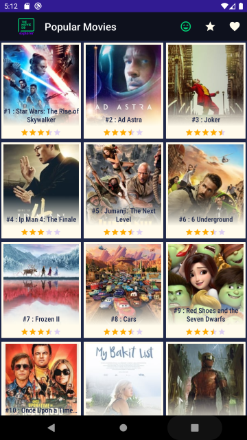
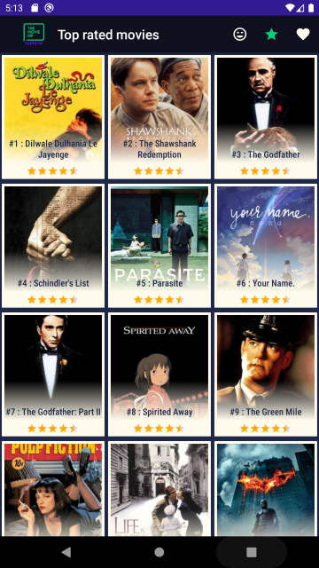
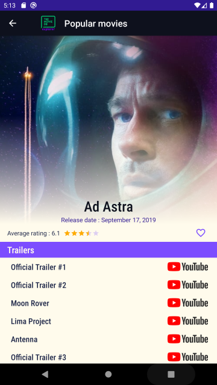
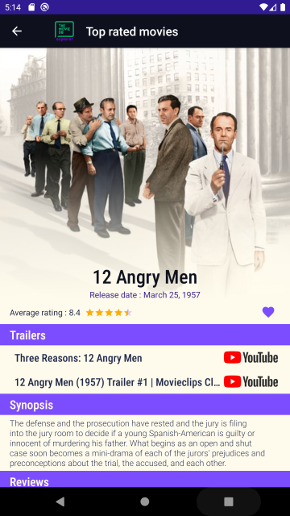

# Udacity-PopularMovies-RxJava

Refactoring for the Popular Movies project from Udacity Android Developer course to use RxJava and Retrofit

## What the project supposed to do

Project Overview

You built a UI that presented the user with a grid of movie posters, allowed users to change sort order, and presented a screen with additional information on the movie selected by the user:

Screen showing details from a individual film

You’ll add more information to your movie details view:

   * You’ll allow users to view and play trailers (either in the youtube app or a web browser).
   * You’ll allow users to read reviews of a selected movie.
   * You’ll also allow users to mark a movie as a favorite in the details view by tapping a button (star).
   * You'll make use of Android Architecture Components (Room, LiveData, ViewModel and Lifecycle) to create a robust an efficient application.
   * You'll create a database using Room to store the names and ids of the user's favorite movies (and optionally, the rest of the information needed to display their favorites collection while offline).
   * You’ll modify the existing sorting criteria for the main view to include an additional pivot to show their favorites collection.

You will build a fully featured application that looks and feels natural on the latest Android operating system.

## The app

I have used RxJava 2 extensively for all the background asyncronious tasks as you will be able to see if you fork this repository.
